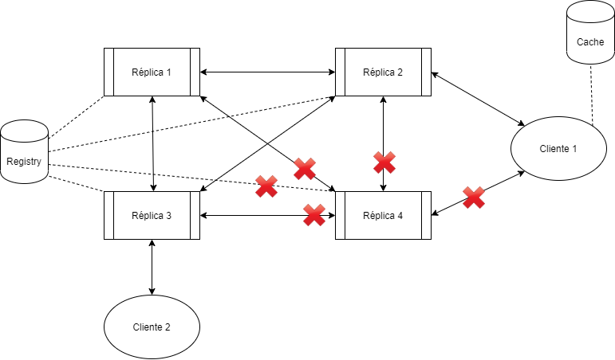

# Relatório do projeto Sauron

Sistemas Distribuídos 2019-2020, segundo semestre

## Autores
  
**Grupo A09** 

| Número | Nome                 | Utilizador                        | Correio eletrónico                                |
| -------|----------------------|-----------------------------------| --------------------------------------------------|
| 89423  | Catarina Machuqueiro | <https://github.com/Catarinaibm>  | <mailto:catarinamachuqueiro@tecnico.ulisboa.pt>   |
| 89446  | Gabriel Almeida      | <https://github.com/galmeida9>    | <mailto:gabriel.almeida@tecnico.ulisboa.pt>       |
| 91004  | Daniel Gonçalves     | <https://github.com/masterzeus05> | <mailto:daniel.a.goncalves@tecnico.ulisboa.pt>    |

  

## Melhorias da primeira parte

- [Testes do `cam_join` para limites inferiores e superiores](https://github.com/tecnico-distsys/A09-Sauron/commit/b656a724d092cfff34f1389078657b251da2bef7)
- [Testes de sucesso para o `report` e `track`](https://github.com/tecnico-distsys/A09-Sauron/commit/b656a724d092cfff34f1389078657b251da2bef7)
- [Utilização do Status do GRPC](https://github.com/tecnico-distsys/A09-Sauron/commit/b656a724d092cfff34f1389078657b251da2bef7)
- [Criação de um módulo para o domínio, com a criação de classes](https://github.com/tecnico-distsys/A09-Sauron/commit/b656a724d092cfff34f1389078657b251da2bef7)
- [Métodos enviam exceções em caso de erro](https://github.com/tecnico-distsys/A09-Sauron/commit/b656a724d092cfff34f1389078657b251da2bef7)
- [Erros no servidor são enviados em exceções para o cliente](https://github.com/tecnico-distsys/A09-Sauron/commit/b656a724d092cfff34f1389078657b251da2bef7)
- [Utilização correta de estruturas concorrentes](https://github.com/tecnico-distsys/A09-Sauron/commit/55b2f3139079c287b379dad2216786e16ecf4bb4)
- [Guia de demosntração mais completo](https://github.com/tecnico-distsys/A09-Sauron/commit/d3f96f2e78a33454f9158320e7f9fe88641abafc)
- [Comentários relevantes](TODO:)

## Modelo de faltas
Faltas toleradas
- Uma réplica falhar entre mensagens de um cliente
- Uma réplica falhar entre mensagens de outra réplica
- Endereços de réplicas inválidos (no contexto das réplicas)
- Alteração dos endereços das réplicas
- Ordem de mensagens trocada

Faltas não toleradas
- Gestor de réplicas não aceitar réplicas
- Endereços de réplicas inválidos (no contexto dos clientes)
- Faltas originadas no `Registry`

## Solução

Quando um cliente conecta-se a um servidor, esse servidor poderá falhar silenciosamente. Então, ao enviar uma operação, o servidor não irá responder, por isso, como implementámos `deadlines` nas operações, passado um tempo a função irá expirar e o cliente tentará de novo, até 3 vezes, a partir daí tenta conectar-se a outro servidor.

A partir do momento em que o cliente troca de réplica, passa-se a utilizar a cache de forma a manter a coerência entre comandos já vistos anteriormente. Esta cache é explicada mais profundamente nas Opções de Implementação.

As réplicas tentam trocar entre si mensagens, mas uma réplica pode falhar silenciosamente, não respondendo a nenhuma mensagem, pelo que irá dar um tempo máximo até à próxima tentativa de envio e passará à frente.

Caso um gestor de réplica tente conectar-se a outro gestor de réplica (utilizando o registry) e este último tenha um endereço inválido, o primeiro irá ignorar e seguir para o seguinte, não bloqueando e tentando de novo na próxima propagação de mensagens.

Caso um endereço de réplica seja alterado, o gestor de réplica irá conseguir conectar-se à tal réplica, pois não guarda registo dos endereços, acedendo ao `registry` que irá devolver o novo endereço correto.

Como a única ordem de causalidade existente é só poder adicionar uma observação depois de adicionar a câmara, e este caso é sempre garantido, pois porque para poder adicionar uma observação a câmara já tem de estar registada na réplica, a ordem das mensagens entre réplica e réplica não é relevante, pois não há ordens de causalidades que possam ter de ser asseguradas.

## Protocolo de replicação

### Explicação do protocolo

Este protocolo consiste na possibilidade de haver várias réplicas e vários clientes, suportando alta disponibilidade e tolerância a partições (AP no teorema CAP), excluindo assim a coerência forte.

Este protocolo pretende que as réplicas devolvam sempre resposta aos clientes e mesmo com partições na rede, enviando assincronamente as operações em fundo.

Cada réplica tem o seu número de instância (de 0 a 9) e permite operações de leitura e de atualização, sendo que estas últimas alteram o estado replicado.

Possui também um timestamp vetorial, de modo a saber quantas operações já efetuou. Isto permite às outras réplicas saber se precisa de receber as operações de outra réplica ou de enviar.

Como este protocolo pretende-se que as réplicas troquem mensagens entre si ao fim de `x` tempo (_gossip_), propagando assim as operações de atualização (sendo este tempo por defeito 30 segundos).

Para verificar que operações têm de ser enviadas de cada vez, compara-se os timestamps, bastando ver que se possui algum versão de uma réplica inferior, é necessário enviar as operações vinda da réplica correspondente.

No contexto do timestamp, só é colocada informação sobre operação de atualização (como o `report`, `cam_join`). Cada operação é constituída por um identificador e a instância de onde foi criada.

Pelo facto deste protocolo excluir a coerência forte, é necessário resolver algumas anomalias como a incoerência entre leituras pelo mesmo cliente (que demonstramos a nossa solução nas opções de implementação) e a violação da causalidade entre operações (que explicamos na solução do modelo de faltas).

### Descrição das trocas de mensagens

De `x` em `x` segundos, cada gestor de réplica envia o seu timestamp para as outras réplicas. E assim cada gestor de réplica que o recebe, devolve o seu próprio timestamp. Desta forma o gestor inicial consegue comparar os timestamps.

O gestor da réplica que enviou o seu timestamp inicialmente compara o seu timestamp com o timestamp de cada outra réplica, verificando se precisa de enviar operações que a outra réplica não tenha, enviando apenas as que lhe faltam.

No lado contrário, o gestor da réplica que recebeu o timestamp inicialmente pode receber timestamps e operações, atualizando-as no seu servidor.

## Opções de implementação

Pelo facto da não existência de coerência forte, é preciso resolver anomalias de leituras incoerentes pelo mesmo cliente, ou seja, quando um cliente está a fazer leituras a uma réplica, entretanto essa réplica falha e o cliente conecta-se a uma nova réplica, este cliente poderá vir a receber operações que não são coerentes com as leituras anteriores, podendo as atuais estarem desatualizadas. Por isso, decidimos implementar uma cache, que é atualizada a cada operação feita pelo cliente, recebendo o timestamp associado a essa operação e guardando as operações conhecidas por este cliente.
> TODO: Adicionar especificações da cache

Tomámos a decisão de que as réplicas deverão tentar enviar as mensagens de atualização para todas as restantes réplicas de forma assíncrona, mantendo um nível mínimo de coerência.

Escolhemos também colocar `deadlines` em todas as operações dos clientes, terminando a operação até uma certa altura, de forma a que a disponibilidade se mantenha elevada, caso exista alguma falta da réplica à qual está conectado. Por defeito, estas operações duram no máximo até 5 segundos, não sendo configurável pelo cliente, atualmente.

Decidimos que a cada troca de mensagens, comparamos totalmente os timestamps, verificando se precisa de alguma operação de qualquer réplica, enviando apenas as que são necessárias de acordo com o timestamp.

Também não verificamos, ao comparar os timestamps, em qual número de operação vai a réplica à qual estamos a enviar operações, pois sabemos que não devemos ter operações criadas nessa réplica a mais do ela própria.